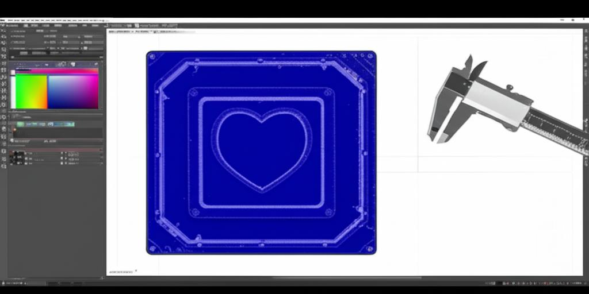

# Gridfinity Inner

[](banner.jpg)

## Purpose

This script generates Gridfinity bins, solid inserts, and image-shaped cut-outs that fit inside Gridfinity bins. It allows you to create customized inserts for organizing your parts and tools within the Gridfinity system.

## Installation

Before using this script, you need to install the required dependencies.  It is highly recommended that you use a virtual environment to manage these dependencies.

```bash
pip install build123d>=0.9
pip install gfthings
pip install opencv-python
```

## Usage

To use the script, run it from the command line with the desired arguments.

```bash
./gridfinity_inner.py [options] shape
```

### Arguments

*   `shape`: Defines the Gridfinity grid size for the bin or insert. It can be specified as two integers (columns rows) or as a series of binary rows (using "1" for solid and "0" for empty). This argument is ignored when using the `--cutout` option.

### Options

*   `--height`: Specifies the height of the bin or insert in Gridfinity units. Default is 3.
*   `--inner`: If present, generates a solid insert instead of a bin.
*   `--cutout IMAGE`: Specifies an image file to use for creating a custom cutout in the insert. The image should depict the desired shape on a 1 cm grid.
*   `--ppmm`: Specifies the pixels-per-millimeter value for the image, useful if auto-detection fails. Default is 10.
*   `--debug`: Enables debug output and visualizations.

## Examples

1.  **Generate a standard 2x3 Gridfinity bin:**

    ```bash
    ./gridfinity_inner.py 2 3
    ```

2.  **Generate a solid insert for a 1x1 grid with a height of 2 units:**

    ```bash
    ./gridfinity_inner.py --inner --height 2 1 1
    ```

3.  **Generate an insert with a custom cutout defined by an image:**

    ```bash
    ./gridfinity_inner.py --inner --cutout image.png 2 2
    ```

4.  **Generate a bin based on binary input:**

    ```bash
    ./gridfinity_inner.py 111 010 111
    ```

    This will create a bin where the first and last rows have three cells and the middle row has the middle cell filled.

## Output

The script generates an STL file that can be 3D printed. The filename is based on the shape and height specified, and includes the cutout name if the `--cutout` option is used.
